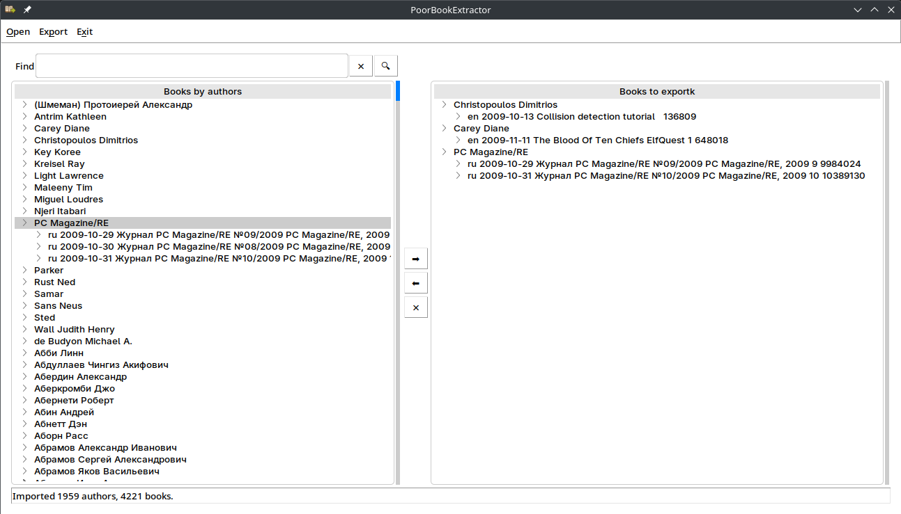
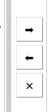

# PoorBookExtractor


**PoorBookExtractor** is a lightweight graphical tool written in Go for viewing, filtering, and exporting metadata from `.inpx` book catalogs. It’s especially useful for managing large personal digital libraries.


---

## ✨ Features

- Parse .inpx book catalog files entirely in memory (no disk extraction required)
- Browse and filter books by author
- Export selected books to a file
- Group exported books by author
- Simple and responsive GUI built with tk
- Clean, modular codebase written in modern Go
- No persistent storage — just open an .inpx file each time you use the app


---

## 📦 Installation

### Ready-to-use portable binary

- Go to [release section](https://github.com/HoskeOwl/PoorBookExtractor/releases) and download executable file for you operation system.
- Run downloaded file.

### Build

#### Requirements

- Go 1.20 or later
- OS with Tk support (Linux, Windows, macOS)
- INPX catalog file

#### Clone and Build

```bash
git clone https://github.com/HoskeOwl/PoorBookExtractor.git
cd PoorBookExtractor
go build -o poorbookextractor main.go
```
--- 

## 📂Usage

- Load inpx
- Find needed authors and place
- Move needed books (you could move all books from selected author)
- Export books

--- 

## 🗔Interface



### 📋 Main Menu


- Open — Load an .inpx file into the program.
- Export — Save the books from the export list to your computer.
- Exit — Close the program.

### 🔍Find authors


- Type one or more words into the text field, separated by spaces.
- 🔍 — Filters authors whose names contain all the entered words.
- ❌ — Clears the text field and displays the full list of authors.
 

 ### 📤 Select Books to Export



- Select a single book or an author, then click ➡ to add the book (or all books by that author) to the export list.
- Select a book or an author in the export list, then click ⬅ to remove it (or all their books) from the list.
- Click ❌ to clear the entire export list.

---

## 📜 License

This project is licensed under the BSD 3-Clause License — see the LICENSE file for details.